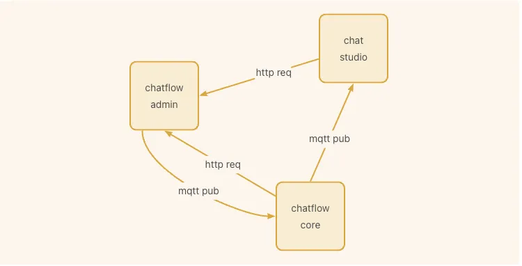

<!-- markdownlint-disable MD013 MD033 -->
# ChatFlow

  [](https://www.npmjs.com/package/@atorber/chatflow)
 
   

## 简介

ChatFlow是一个聊天机器人管理系统，可以帮助你实现一些原生IM无法支持的功能。

如果你是一个社群工作者、微信群私域运营人员，使用这个项目可以帮助你解决一些自动化问题。

基于开源项目Wechaty实现，目前主要验证了对WeChat的支持，理论上支持钉钉、飞书、whatsapp等Wechaty已实现的所有IM。

支持在Linux、Mac、Windows上运行。

[访问项目语雀文档查看完整使用说明](https://www.yuque.com/atorber/chatflow)



### 功能列表

|功能|描述|
|--|--|
|定时提醒|定时消息发送，支持单次定时和周期消息发送给指定好友或群|
|智能问答|可以自定义问答内容，智能匹配答案，支持相似问题匹配，例如“什么时候到货？”“亲，几时到货”“亲，什么时候到货”均能匹配（基于微信对话开放平台，免费）|
|ChatGPT问答|已对接ChatGPT，支持使用ChatGPT作为聊天机器人呢|
|群发通知|向群或好友批量下发消息|
|消息存档|群聊天消息存档到表格（基于vika维格表，免费），可以在维格表中对聊天消息进行进一步统计、筛选、分析等|
|活动报名|群内接龙报名，使用 报名/取消 指令统计活动报名|
|白名单|支持配置群白名单，白名单内群开启机器人问答/活动报名/ChatGPT问答，未配置问题答案的群不会受到机器人干扰|
|MQTT消息推送|支持配置一个MQTTQ消息队列，将消息推送到队列当中|
|远程控制发消息|支持通过MQTT控制机器人向指定好友或群发消息|
|Web控制台|Web端控制台预览版已上线，抢险体验可以访问 chat.vlist.cc|

> 移步语雀文档查看 [详细功能查看](https://www.yuque.com/atorber/oegota/aialc7sbyb4ldmg4/edit)

## 快速开始

> 升级代码后建议配置全新的维格表空间或删除原空间全部表，请使用nodejs16或18，最新的nodejs20可能无法运行

最新部署方法参考：[ChatFlow3.0Beta部署运行](https://www.yuque.com/atorber/chatflow/gbpvgf01cw0nlxu4)

1.下载代码及安装启动

1.1 下载并运行chatflow-admin

```Shell
git clone https://github.com/atorber/chatflow-admin.git
cd chatflow-admin

# 安装依赖
npm i

# 启动api服务
npm run start:dev
```

1.2 下载并运行chatflow

```Shell
git clone https://github.com/atorber/chatflow.git
cd chatflow
```

2.分别登陆[微信对话开放平台](https://openai.weixin.qq.com/)和[vika维格表](https://spcp52tvpjhxm.com.vika.cn/?inviteCode=55152973)官网注册账号并获取token

3.重命名.env.example文件为.env并修改配置文件

> 快速开始仅需要修改VIKA_TOKEN、VIKA_SPACE_NAME、ADMINROOM_ADMINROOMTOPIC配置项,其他配置项暂时无需修改，使用微信对话开放平台时配置WXOPENAI_TOKEN、WXOPENAI_ENCODINGAESKEY

```.env
# Wechaty
WECHATY_PUPPET="wechaty-puppet-wechat4u" # 可选值：wechaty-puppet-wechat4u、wechaty-puppet-wechat、wechaty-puppet-xp、wechaty-puppet-engine、wechaty-puppet-padlocal、wechaty-puppet-service
WECHATY_TOKEN="" # 使用wechaty-puppet-padlocal、wechaty-puppet-service时需配置此token

# 基础配置
ADMINROOM_ADMINROOMTOPIC="替换为你的管理员群名称" # 管理群名称，需尽量保持名称复杂，避免重名群干扰

# 维格表配置
VIKA_SPACE_ID="替换为你的维格表空间ID" # 维格表空间ID或飞书多维表格的appToken
VIKA_TOKEN="替换为你的维格表token" # 维格表token或飞书多维表格信息拼接（使用'/'拼接三个参数：appId/appSecret/appToken）
ENDPOINT="http://127.0.0.1:9503" # 后端管理服务API地址，默认http://127.0.0.1:9503
```

4.启动程序

```Shell
npm run start
```

出现二维码之后，扫码二维码登陆微信

5.开启智能问答功能

5.1 设置微信对话平台token，填写【环境变量|Env】表中的 【微信对话开放平台-Token】、【微信对话开放平台-EncodingAESKey】、【微信对话开放平台-APPID】、【微信对话开放平台-管理员ID】并将【智能问答-启用自动问答】修改为 true

5.2 添加问题到【问答列表|Qa】，添加之后在管理员群内发送【更新问答】

5.3 将群加入到【白名单|WhiteList】，在【白名单|WhiteList】表中，所属应用选择【智能问答|qa】

> 群ID在消息中查看(在群里发一条消息，然后控制台查看或在维格表中查找)

5.4 在管理群发送【更新白名单】或者重启程序

详细操作参考 [手把手教程](https://www.yuque.com/atorber/oegota/zm4ulnwnqp9whmd6)

## NPM包运行

### 安装依赖包

```Shell
npm i @atorber/chatflow
```

```Shell
#!/usr/bin/env -S node --no-warnings --loader ts-node/esm
/* eslint-disable sort-keys */
import 'dotenv/config.js'
import {
  WechatyBuilder,
} from 'wechaty'

import {
  ChatFlow,
  getBotOps,
  logForm,
  init,
} from '@atorber/chatflow'

const main = async () => {

  // 从环境变量中获取配置信息, 在环境变量中已经配置了以下信息或者直接赋值
  const WECHATY_PUPPET = process.env['WECHATY_PUPPET']
  const WECHATY_TOKEN = process.env['WECHATY_TOKEN']
  const VIKA_SPACE_ID = process.env['VIKA_SPACE_ID']
  const VIKA_TOKEN = process.env['VIKA_TOKEN']
  const ADMINROOM_ADMINROOMTOPIC = process.env['ADMINROOM_ADMINROOMTOPIC'] // 管理群的topic，可选

  // 构建wechaty机器人
  const ops = getBotOps(WECHATY_PUPPET, WECHATY_TOKEN) // 获取wechaty配置信息
  const bot = WechatyBuilder.build(ops)

  // 初始化检查数据库表，如果不存在则创建
  try {
    await init({
      spaceId: VIKA_SPACE_ID,
      token: VIKA_TOKEN,
    })
  } catch (e) {
    logForm('初始化检查失败：' + JSON.stringify(e))
  }

  // 启用ChatFlow插件
  bot.use(ChatFlow({
    spaceId: VIKA_SPACE_ID,
    token: VIKA_TOKEN,
    adminRoomTopic: ADMINROOM_ADMINROOMTOPIC,
  }))

  // 启动机器人
  bot.start()
    .then(() => logForm('1. 机器人启动，如出现二维码，请使用微信扫码登录\n\n2. 如果已经登录成功，则不会显示二维码\n\n3. 如未能成功登录访问 https://www.yuque.com/atorber/chatflow/ibnui5v8mob11d70 查看常见问题解决方法'))
    .catch((e: any) => logForm('机器人运行异常：' + JSON.stringify(e)))
}

void main()

```

## 在Docker中部署运行

注意，因为wechaty-puppet-xp必须依赖Windows微信客户端，所以不能使用Docker，但使用wechaty-puppet-padlocal、wechaty-puppet-service则可以用Doker来部署，

最新代码已经默认wechaty-puppet-wehcat为初始化puppet，mac、linux系统直接拉取镜像即可运行（mac M1需要自行打包镜像）

> 移步语雀文档查看 [手把手教程](https://www.yuque.com/atorber/oegota/zm4ulnwnqp9whmd6)

### 拉取和运行

- 最新版本

```Shell
docker run -d --restart=always 
--env VIKA_TOKEN="维格表token" 
--env VIKA_SPACE_NAME="维格表空间名称" 
--env ADMINROOM_ADMINROOMTOPIC="超哥是群主" 
atorber/chatflow:latest
```

## Wechaty-Puppet支持

|puppet名称|支持平台 |需要token |付费| 备注|
|--|--|--|--|--|
|wechaty-puppet-wechat| Windows、Linux、macOS |否| 否 |网页版wechat，无法获取真实的微信ID和群ID，重启之后ID可能会变|
|wechaty-puppet-xp|Windows| 否| 否 |仅支持windows|
|wechaty-puppet-padlocal👍| Windows、Linux、macOS| 是 |是 |
|wechaty-puppet-service👍| Windows、Linux、macOS| 是 |是 |企业微信|

> 特别注意，Wechaty-Puppet是wechaty的概念，本项目不涉及机器人开发，只是使用wechaty项目进行业务功能实现，什么是[Wechaty](https://wechaty.js.org/)请点击链接进行了解学习

## 视频演示及使用教程

到项目官网 [查看视频教程](https://qabot.vlist.cc/)

## 常见问题及解决方案

1. 加入QQ群 583830241 在线交流，添加 ledongmao 微信

2. 到 [项目语雀知识库](https://www.yuque.com/atorber/oegota/ibnui5v8mob11d70) 查看常用问题

3. 提交一个issues <https://github.com/atorber/chatflow/issues>

## 效果展示

去 [效果展示图文](https://www.yuque.com/atorber/oegota/tbsokg3pqu5vk50y) 查看

## 二次开发

此项目只是提供了一个简单的使用微信机器人和智能对话平台实现的QA系统。如果有兴趣，可以继续学习微信对话开放平台的高级技能，实现诸如连续问答等高级功能，欢迎贡献你的创意。

此外要说明的是，项目中使用puppet-xp完全是出于免费的考虑，如果不考虑这一点的话，wechaty还有更好用的puppet，对于有能力的开发者来说可以根据实际情况替换。

### TODO LIST

- 消息群发，通知消息同时发布到多个群

- 消息转发，按设定规则转发消息

- 使用VIKA托管配置文件

### 相关依赖

项目用到了一些免费且好用的开源项目和平台

> 如果你是团长可忽略此段内容，开发者可进一步了解

- [Wechaty](https://wechaty.js.org/)

  只需几行代码，您就可以拥有一个功能齐全的聊天机器人

- [wechaty-puppet-xp](https://github.com/wechaty/puppet-xp)

  可能是目前最好用的免费wechat机器人

- [wechaty-puppet-wechat](https://github.com/wechaty/puppet-wechat)
  
  目前最简单的免费wechat机器人

- [微信对话开放平台](https://openai.weixin.qq.com/)

  5分钟零基础免费一键搭建智能对话机器人，并应用于微信公众号、小程序、企业网站、APP等

- [vika维格表](https://spcp52tvpjhxm.com.vika.cn/?inviteCode=55152973)

  将过去复杂的IT数据库技术，做得像表格一样简单(如果要注册，通过这个链接，或者使用邀请码 55152973 )

## 更新日志

### 3.0.0-Beta-11

- 移除环境变量依赖

### 3.0.0-Beta-10

- 新增媒体资源接口
- 新增进群欢迎语接口
- 新增顺风车接口

### 3.0.0-6

- 全部接口切换到chatfow-admin，更加稳定可靠
- 修复微信对话开放平台bug
- 增加ChatGPT支持

### 3.0.0-5

- 适配飞书多维表格，初步测试通过

## Star History

[](https://star-history.com/#atorber/chatflow&Date)
